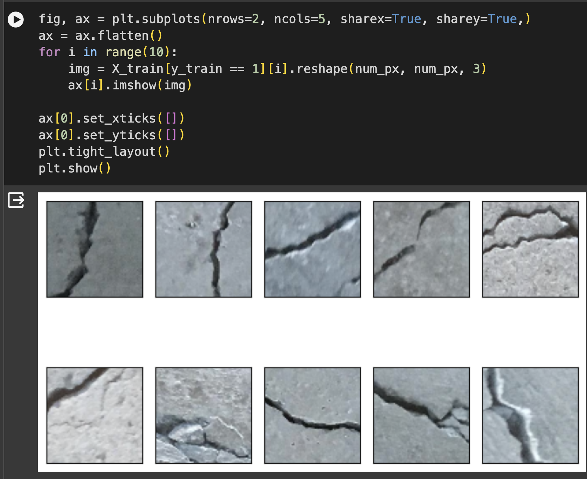
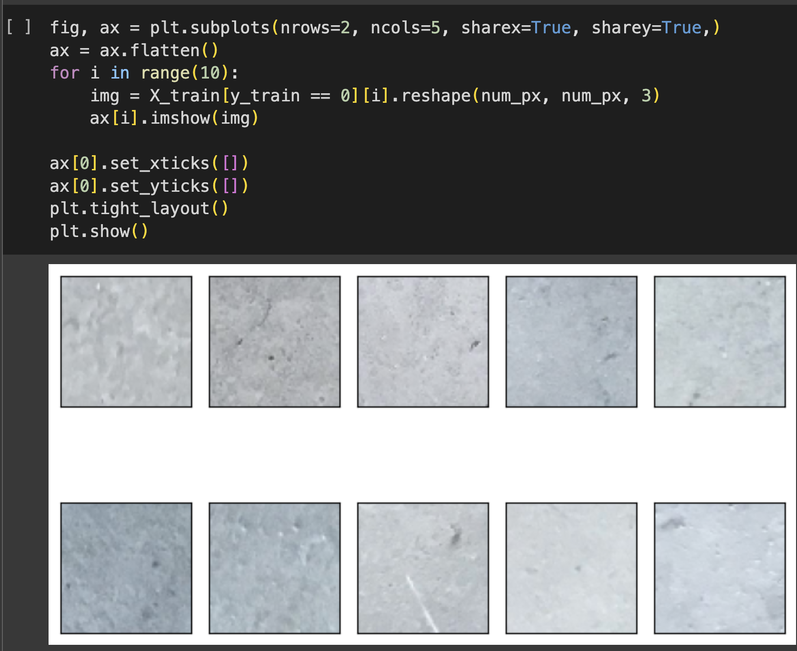
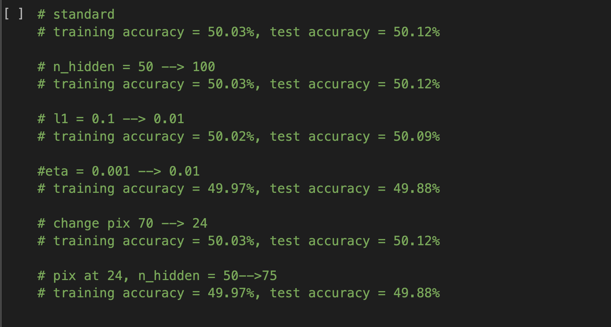
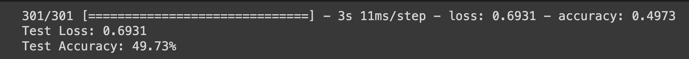
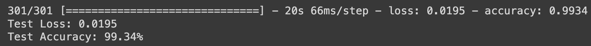

# Surface Crack Image Classification With Neural Network 

## Packages and Tools 

Simple neural network using neural network from Python Machine Learning by Sebastian Raschka & Vahid Mirjalili. This network is a double layer network, with one hidden layer and one output layer. The jupyter notebook is ran using Google's Colab: [Simple Neural Network Notebook](https://colab.research.google.com/drive/11EJQ7crPcKBE-hroJAyZJ0gt85RWyZfE?usp=sharing)

We also created another neural network using Tensorflow and Keras: [TensorFlow Neural Network Notebook](https://colab.research.google.com/drive/1zT3Lsf9mOFdH0kTLNDTt5lhBeFapxVBk?usp=sharing)

## Project 

The aim of the project is to train a neural network model to classify if an image of a concrete has a crack in it or not. 

<p align="center">
  
   
</p>

### Data 
There are 32k images in the training data, each at 227 px. Converting them into matrixes with pixelLength x pixelLength x 3 (due to RGB). This results in a very large matrix and the instance of Colab that it's running on would run out of ram. To circumvent this, we restricted the pixel length to 70 pixels which seems to be the max when running the notebooks on Colab while leaving enough ram to train the model later on. 

### Simple Neural Network 
With the simple neural network, the configurations we set up are as followed: 
```
nn = NeuralNetMLP(n_output=2,
                  n_features=X_train.shape[1],
                  n_hidden=50,
                  l2=0.1,
                  l1=0.1,
                  epochs=50,
                  eta=0.01,
                  alpha=0.01,
                  decrease_const=0.00001,
                  minibatches=100,
                  shuffle=True,
                  random_state=1)

```
   

The results of the neural networks is around 50% accuracy rate, and toggling the different configurations of the model seems to result in negligent change. 

### TensorFlow Model 

With Tensorflow, we created two models: 
- one that mimics the simple neural network above with more layers
- a convoluted neural network 

#### Simple Neural Network in Tensorflow
```
model = tf.keras.Sequential([
    tf.keras.layers.Rescaling(1./255),
    tf.keras.layers.Flatten(),  # Flatten layer to convert input to 1D
    tf.keras.layers.Dense(128, activation='sigmoid'),  # Hidden layer with sigmoid activation
    tf.keras.layers.Dense(64, activation='sigmoid'),  # Hidden layer with sigmoid activation
    tf.keras.layers.Dense(32, activation='sigmoid'),  # Hidden layer with sigmoid activation

    tf.keras.layers.Dense(num_classes, activation='relu')  # Output layer with ReLU activation
])
```
This simple model has similar results as the previous models. 
   

#### CNN with Tensorflow 
```
model = models.Sequential([
    layers.Conv2D(32, (3, 3), activation='relu', input_shape=(img_height, img_width, 3)),
    layers.MaxPooling2D((2, 2)),
    layers.Conv2D(64, (3, 3), activation='relu'),
    layers.MaxPooling2D((2, 2)),
    layers.Conv2D(128, (3, 3), activation='relu'),
    layers.MaxPooling2D((2, 2)),
    layers.Flatten(),
    layers.Dense(128, activation='relu'),
    layers.Dense(1, activation='sigmoid')  # Binary classification, so using sigmoid activation
])
```

CNN is the model that Tensorflow tutorials also implements in their image classification module. This model has a high accuracy rate. 
   

